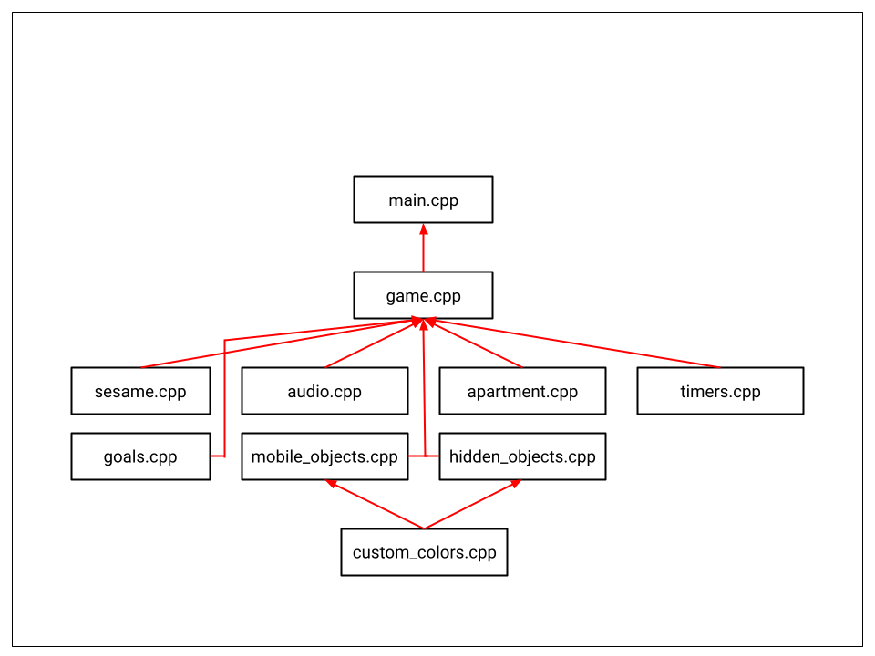

# Sesame's Quest
Sesame's Quest is a simple 2D game built using C++, the Piskel website, and the Raylib library. To win the game, the cat, Sesame, must find the hidden treat box, eat the treats, and then hide the empty treat box before time runs out and her owner returns home. There are several objects hidden around the apartment, so Sesame must interact with as much as she can until she reveals the delicious treats.
 
# Notes
- The software used to make the sprites and background is an online pixel editor called Piskel

# Final Comments
- The pixel editor portion of the game was the most challenging
- I really enjoyed applying software engineering concepts I learned from class to this project

# Class Interaction Diagram

# References
- ["Programming With Nick" VS Code template](https://github.com/educ8s/Raylib-CPP-Starter-Template-for-VSCODE-V2)
- [Creating Sprite Images for Animations](https://youtu.be/xQk0W7AGh74?si=ELZMXN50-hJN8Kjb) 
- [Raylib Tutorial | Episode 3 | Drawing textures and animating](https://youtu.be/pFgDWPbUrqk?si=CwrC-XqSSHEXDwpb)
- [How to Toggle Fullscreen in Raylib](https://youtu.be/_yt8RxYKx6Q?si=qsF0PF4DVaipjbGD)
